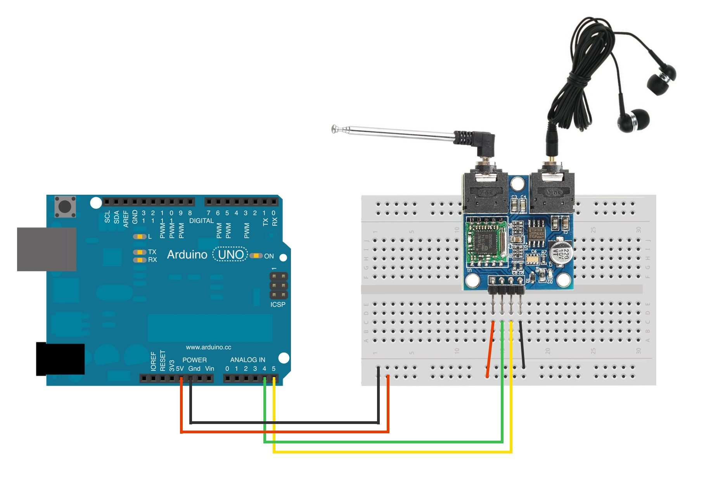
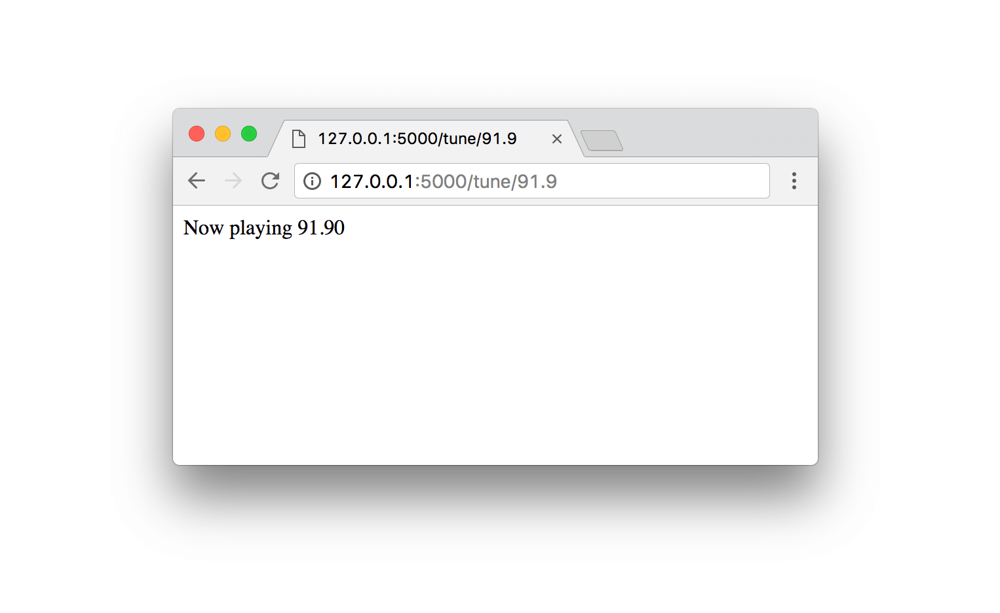
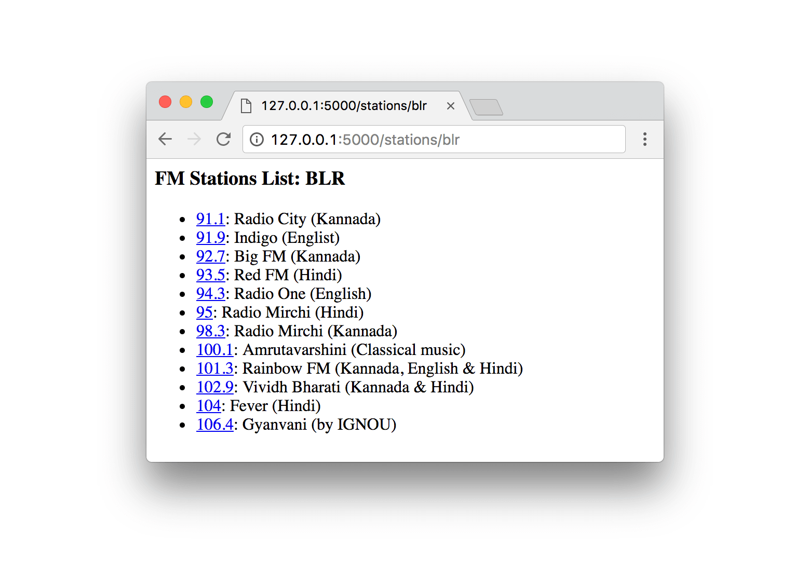

# Radio
> 📻 FM radio receiver using Arduino & TEA5767 module

## Pre-requisites

#### Hardware:
- Arduino UNO
- TEA5767 FM Module

#### Software:
- [Arduino IDE](https://www.arduino.cc/en/Main/Software)
- Python 3.x

# Setup

## 1. Connection



## 2. Arduino
1. Install the following Libraries in Arduino IDE:
	- [Wire](https://www.arduino.cc/en/Reference/Wire)
	- [TEA5767](https://github.com/andykarpov/TEA5767)

2. Connect Arduino to laptop via USB cable
3. From Arduino IDE, compile & upload the sketch `sketch/radio.ino` to the Arduino board. 


## 3. Server 

#### Configuration
Update `SERIALPORT` value in `python/config.py`. 

To list the ports:
```
ls /dev/tty.*
```
(The available USB ports in MacBook Pro are something like `/dev/cu.usbmodem1411` and `/dev/cu.usbmodem1421`.)


#### Starting server
```
FLASK_APP=python/radio.py flask run
```
This will start the server in [127.0.0.1:5000](http://127.0.0.1:5000)

# APIs available

##### 1. Tune to a frequency
```
/tune/<frequency>
```
eg: [127.0.0.1:5000/tune/98.3](http://127.0.0.1:5000/tune/98.3)



##### 2. List of predefined stations
```
/stations/<location>
```
To avail this info, you have to update stations list in `config.py`. Currently only Bangalore(BLR) FM stations are listed.

[127.0.0.1:5000/stations/blr](http://127.0.0.1:5000/stations/blr)



## Pending tasks
- [ ] Scan mode
- [ ] Prev-next station navigation
- [ ] Volume control
- [ ] Speaker instead of headset

### References:
[http://www.ardumotive.com/how-to-use-the-tea5767-fm-radio-module-en.html](http://www.ardumotive.com/how-to-use-the-tea5767-fm-radio-module-en.html)
